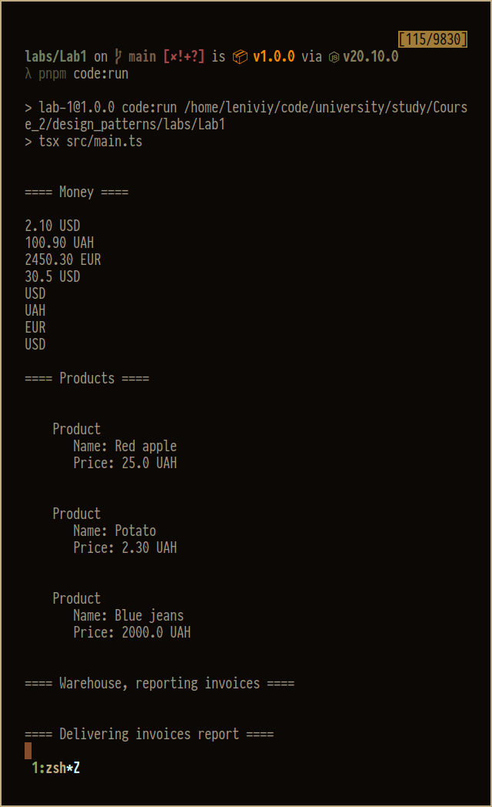
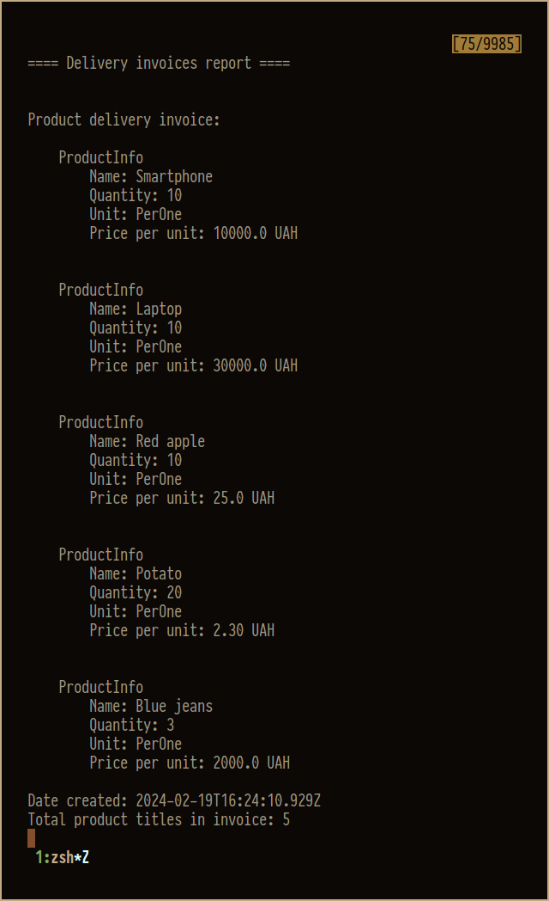
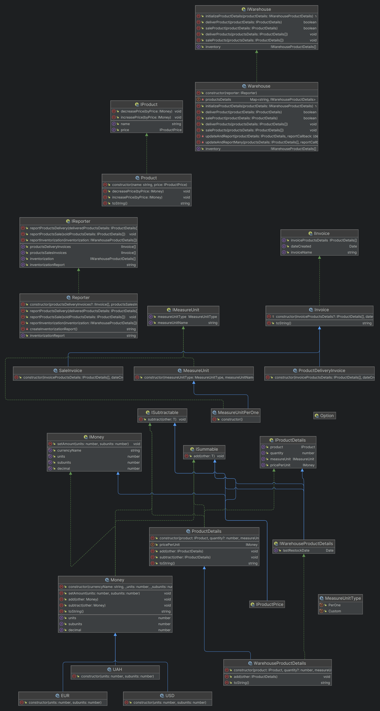

# Run

```shell
npm run code:run
```

# Visual examples




# Diagram



# Programming principles used in code

## SRP (single responsibility principle)

Classes aren't responsible for unneeded things, for example, classes like [Money](src/implementations/money.ts) or [MeasureUnit](src/implementations/measureUnit.ts) are only responsible for the piece of logic they're meant to hold no more, no less. Another example is [warehouse class](src/implementations/warehouse.ts), it has only methods related to dealing with information about products in that warehouse, other pieces functionality like products, details, money and invoices reporting have their own classes.

## OCP (open-closed principle)

It states that classes must be closed for modification but opened for extensions, as an example here might work [product details](src/implementations/productDetails.ts#L13) and [warehouse product details](src/implementations/productDetails.ts#L62). Product details class holds main basic info needed for reports like product, quantity, measure unit, price per unit, etc. This is completely enough for the invoices, but warehouse also needs to store some information about latest restock dates for its product titles, so here goes the warehouse details class, which extends the product details adding functionality for latest restock dates without modifying the base class but extending it via deriving.

## LSP (liskov substitution principle)

The Principle states that superclass must be replaceable by its subclasses without breaking functionality, for example, there may be considered [money abstract class](src/implementations/money.ts), and classes that derive from it (a couple of national currencies). When testing the following code, all of these subclasses may be placed in one generic list of type
_Money_ without breaking functionality or introducing any new bugs.

```typescript
logTitle('Money')
const prices: Money[] = [
  new USD(2, 10),
  new UAH(100, 90),
  new EUR(2450, 30),
  new USD(30, 5)
]
prices.forEach((price) => console.log(price.toString()))
prices.map((price) => price.currencyName).forEach((name) => console.log(name))
```

```shell
==== Money ====

2.10 USD
100.90 UAH
2450.30 EUR
30.5 USD
USD
UAH
EUR
USD
```

## ISP (interface segregation principle)

Different pieces of behavior are separated among different interfaces without making any monstrously big interfaces bloated with unneeded methods or properties, for example, there are two interfaces that describe the ability of some class to be [summed](src/interfaces/ISummable.ts) or [subtracted](src/interfaces/ISubtractable.ts). Overall, there are [plenty of](src/interfaces) interfaces

```shell
 src/interfaces
├──  IInvoice.ts
├──  IMeasureUnit.ts
├──  IMoney.ts
├──  index.ts
├──  IProduct.ts
├──  IProductDetails.ts
├──  IProductPrice.ts
├──  IReporter.ts
├──  ISubtractable.ts
├──  ISummable.ts
├──  IWarehouse.ts
└──  IWarehouseProductDetails.ts
```

## DIP (dependency inversion principle)

High-level modules are not dependent on low-level ones instead they're using abstractions, for example, class Warehouse doesn't know anything about a reporter given to it via [constructor](src/implementations/warehouse.ts#L12) except its implementing [IReporter](src/interfaces/IReporter.ts) interface. Warehouse doesn't create it by hand as it's completely unrelated work. Instead, it just uses given somewhere-created implementation of IReporter interface by its declared contract, which means implementations of this interface may vary from simple console invoices logger, to some more complex email sender + pdf generator module. With such an approach, it's much easier to decouple classes, use dependency injection and write tests.

## Fail Fast

Code throws exceptions as early as possible. For example, [money class](src/implementations/money.ts) immediately throws errors if user tries to change subunits to value out of accepted range. So the program won't silently continue to execute without giving proper exception that may be handled properly on more top-level code.

```typescript
set subunits(value: number) {
    if (value < 0 || value >= 100)
        throw new RangeError('Subunits must be between 0 and 99.')
    this._subunits = value
}
```

## Program to Interfaces not Implementations

Code mostly uses not the exact implementations, but instead stores/accepts/returns some interfaces. Besides warehouse and reporter which already were described in DIP section, there's classes like [product](src/implementations/product.ts) which accepts not the concrete implementation of money but something that implements IProductPrice (which in its own way means implementing IMoney and interfaces for summing and subtracting behaviour over values of IMoney interface); or [product details](src/implementations/productDetails.ts) which accept product by its interface, and also implements interfaces for summing and subtracting behaviour, so it's possible in the future to deliver new products to existing ones (details + details) and sale them from warehouse (details - details), also generating invoices based on those details.
