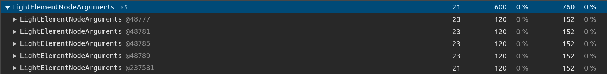
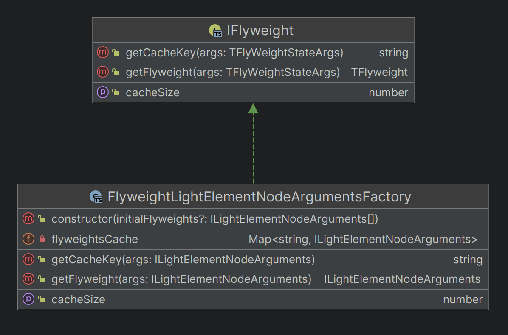
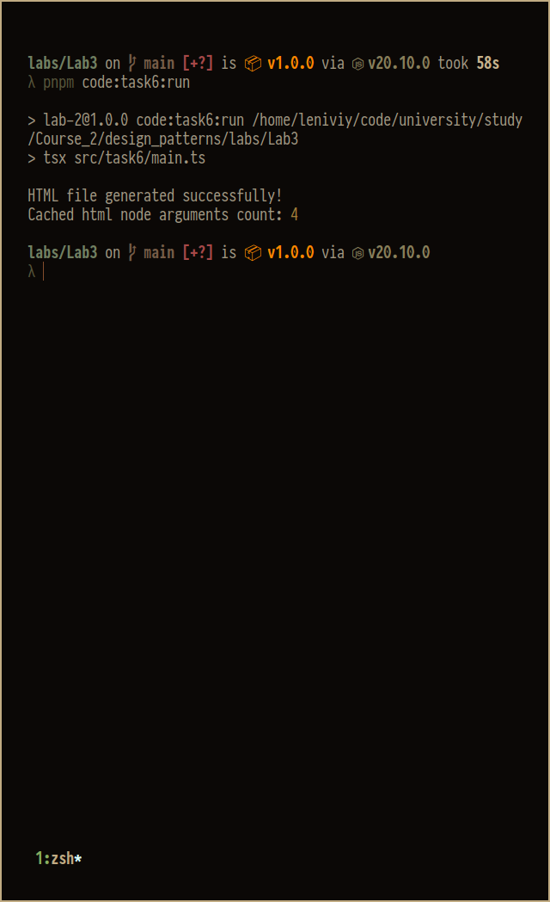

# Flyweight memory usage tests

Before applying the flyweight pattern, when every LightElementNode held all the configuration data inside, duplicating it for every new html node, elements tree used 497 288 bytes on the heap as shallow size and 4 197 872 bytes as retained size.

After subtracting state in the form of html node arguments and caching them applying flyweight pattern memory usage on the heap reduced to 361 664 bytes as shallow size and 3 546 232 bytes as retained size.

Memory usage decrease is:

- 31.6% (shallow size)
- 17% (retained size)

Also, as arguments for the nodes were cached, there are only 5 of them (4 for types of nodes needed for parsing book, and 1 for top-level parent container) and they use less than 1k bytes in total, meaning in the process of parsing the book, code wasn't creating the same data over and over again.

Snapshots available

- [without flyweight](../../heap%20without%20using%20flyweight.heapsnapshot)
- [with flyweight](../../heap%20using%20flyweight.heapsnapshot)

# Diagram

# Example of work

