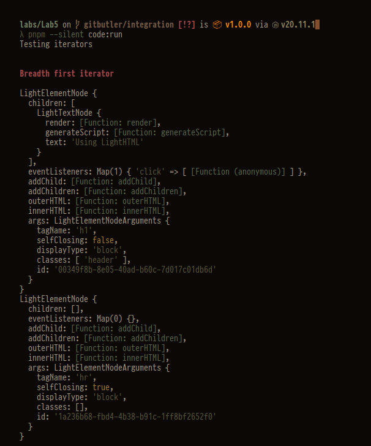
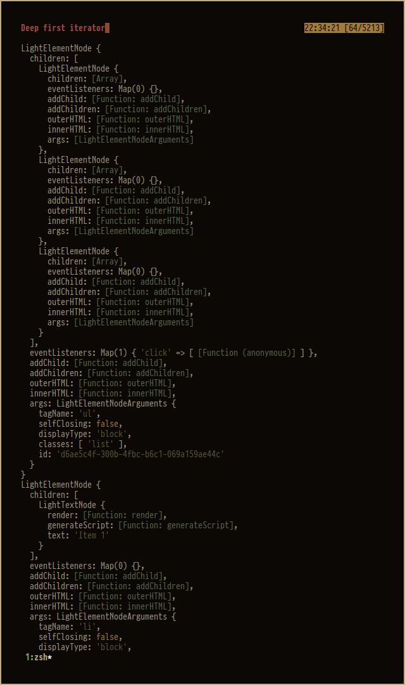
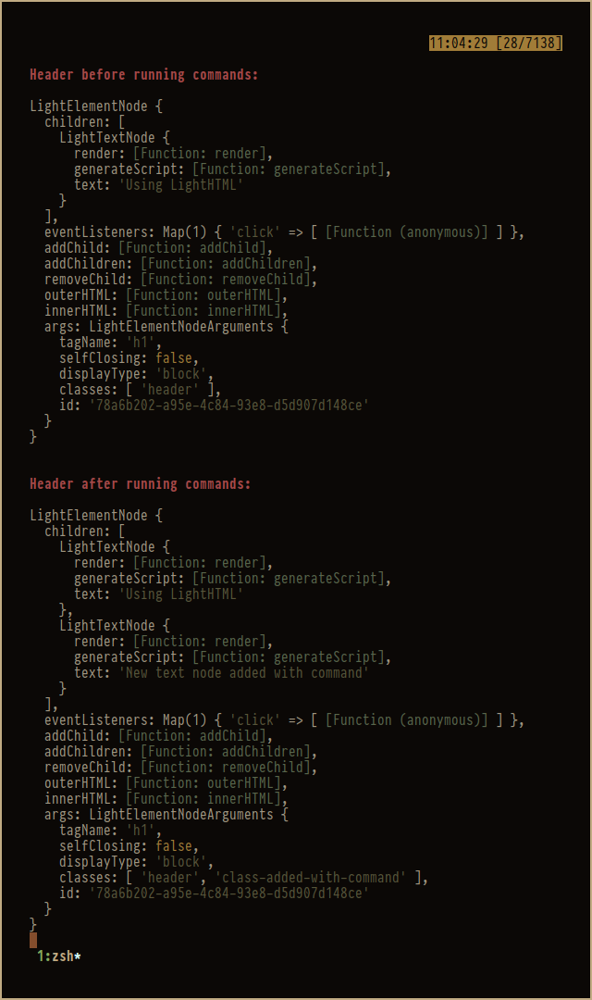
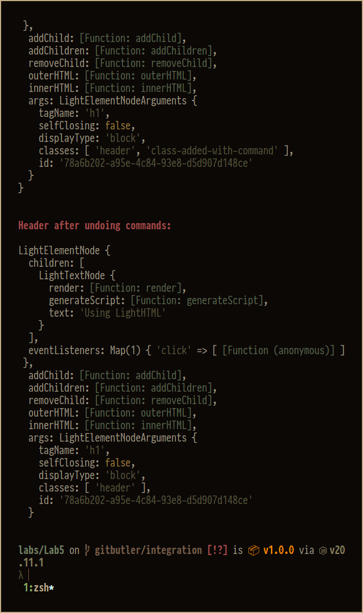
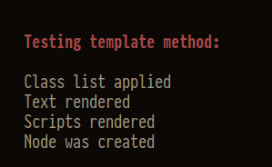
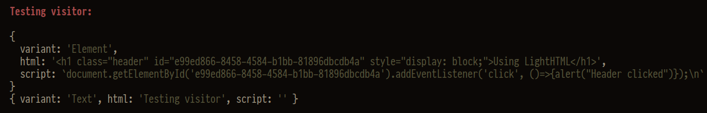
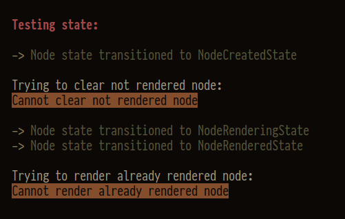
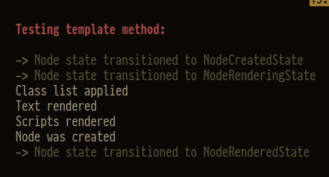

# Tasks

# Run

```shell
npm i
npm run code:run
```

or with pnpm

```shell
pnpm i
pnpm code:run
```

## Iterator

Breadth iterator (goes through given list of nodes directly):



Deep iterator (recursively iterates over nodes children):



## Command

Executing commands to add new class and new child for the header node:



Undoing changes introduced by commands:



## Template method



## Visitor



## State



Also with template method:


